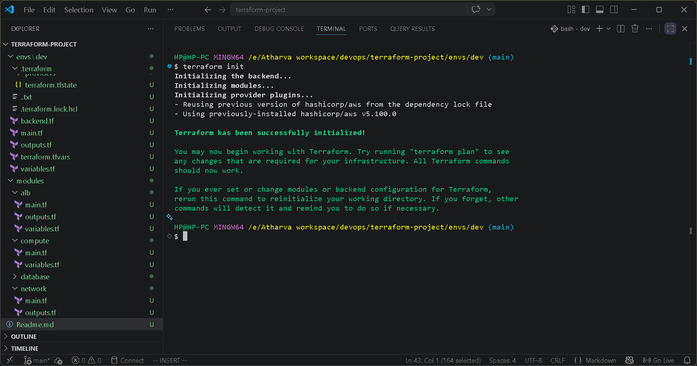
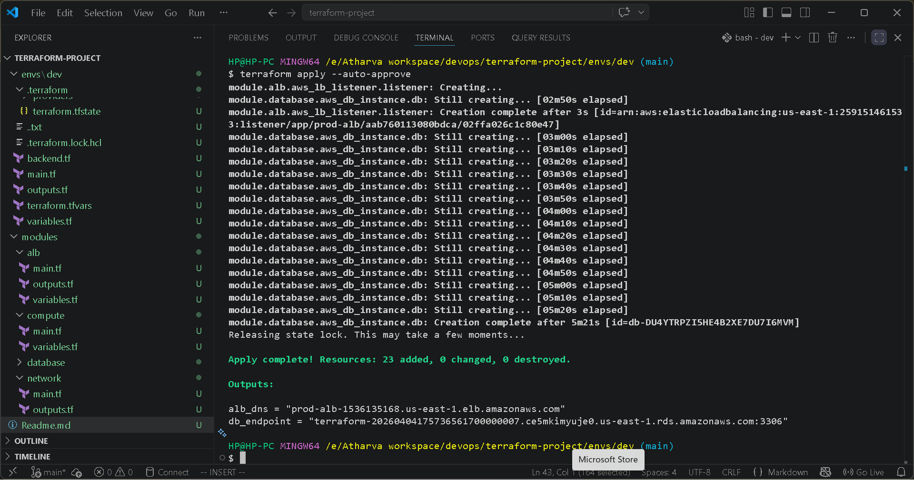
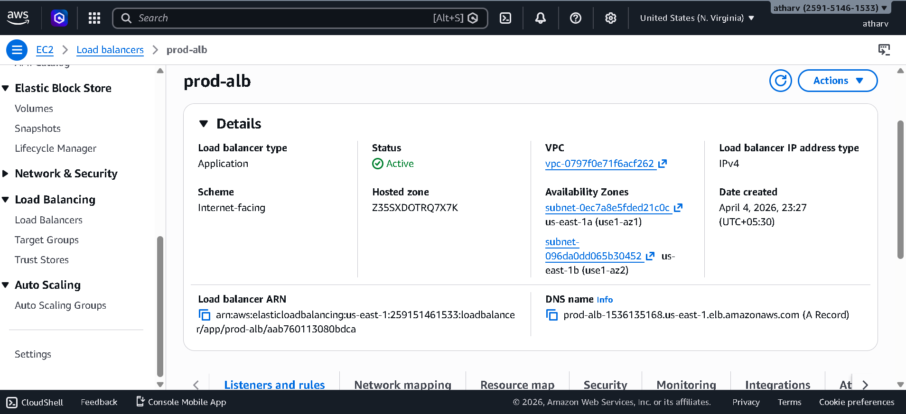
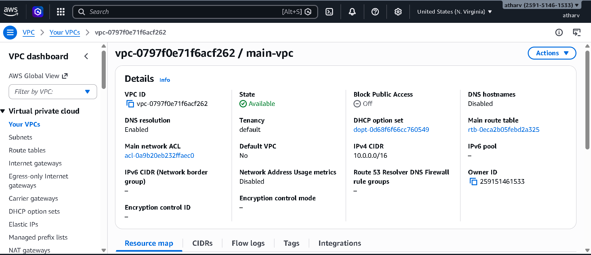
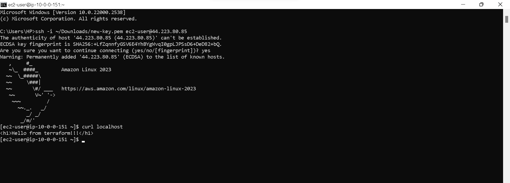

# 🚀 AWS DevOps Project using Terraform

---

## 📌 Overview

This project demonstrates a **production-grade AWS infrastructure** built using **Terraform (Infrastructure as Code)**. It simulates a real-world DevOps setup with scalable, secure, and highly available architecture.

The application is deployed on **EC2 instances (Nginx)** behind an **Application Load Balancer**, with infrastructure split across **public and private subnets**.

---

## 🏗️ Architecture


### 🔄 Request Flow

```
User → Internet → ALB (Public Subnet) → EC2 (Private Subnet) → RDS (Private Subnet)
```

---

## ⚙️ Tech Stack

* **Cloud**: AWS (VPC, EC2, ALB, ASG, RDS, NAT Gateway)
* **IaC**: Terraform
* **OS**: Amazon Linux
* **Web Server**: Nginx

---

## 📁 Project Structure

```
terraform-project/
│
├── envs/
│   └── dev/
│       ├── main.tf
│       ├── variables.tf
│       └── terraform.tfvars
│
├── modules/
│   ├── network/
│   ├── alb/
│   ├── compute/
│   └── database/
│
├── screenshots/
└── README.md
```

---

## 🚀 Deployment Steps

### 1️⃣ Initialize Terraform

```bash
terraform init
```

📸 *Terraform Initialization Output*


---

### 2️⃣ Plan Infrastructure

```bash
terraform plan
```

📸 *Terraform Plan Output*


---

### 3️⃣ Apply Configuration

```bash
terraform apply
```

📸 *Terraform Apply Output*


---

## 🌐 Application Access

After deployment:

* Copy **ALB DNS name**
* Open in browser:

```
http://<your-alb-dns>
```

📸 *Application Running via ALB*


---

## ⚙️ AWS Resources Verification

### 🔹 Load Balancer

📸


---

### 🔹 Target Group Health

📸


---

### 🔹 EC2 Instances (Auto Scaling)

📸


---

### 🔹 VPC & Subnets

📸


---

## 🧪 Testing

### SSH into EC2

```bash
ssh -i key.pem ec2-user@<public-ip>
```

### Verify Nginx

```bash
curl localhost
```

Expected:

```
Hello from Terraform 🚀
```

📸 *Nginx Output*


---


