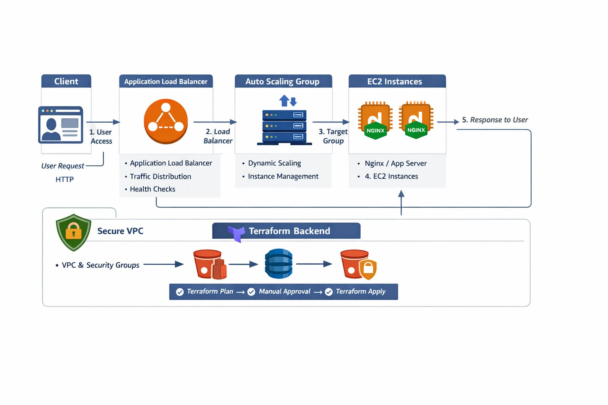
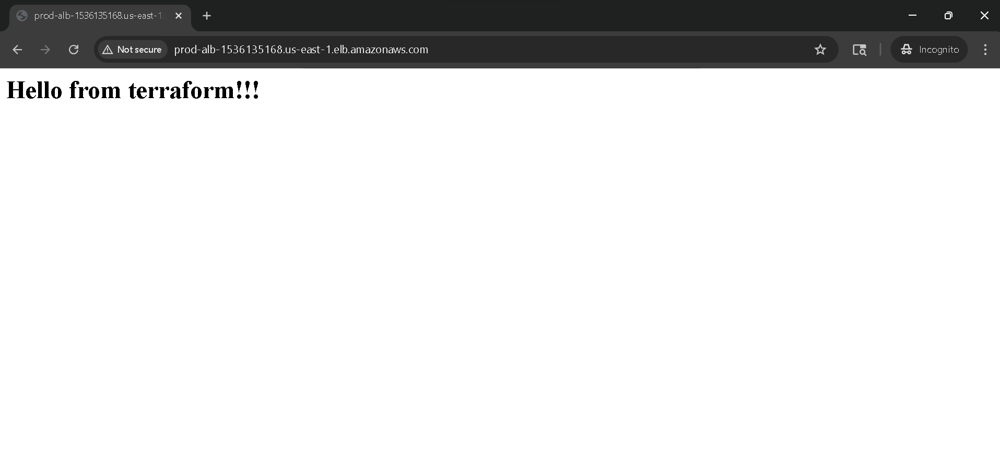
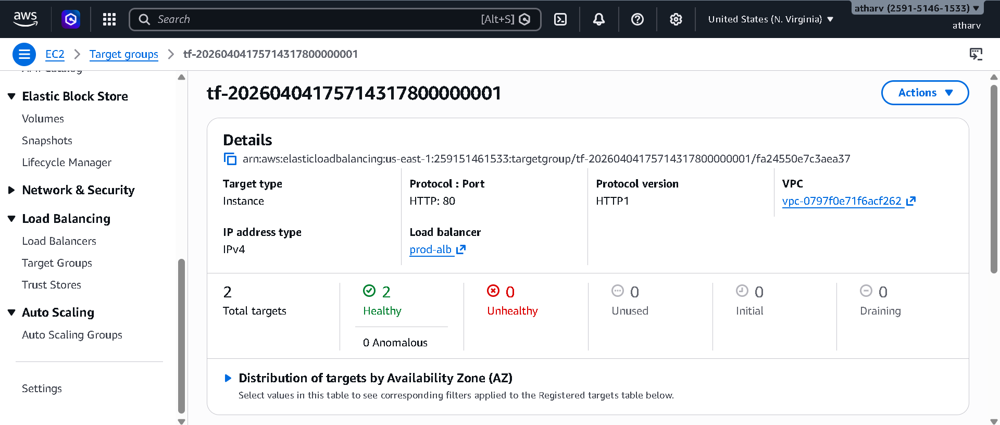
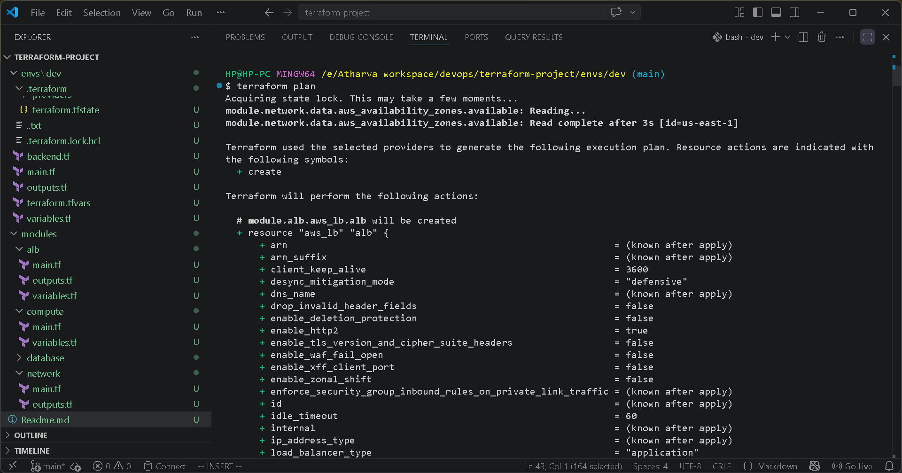
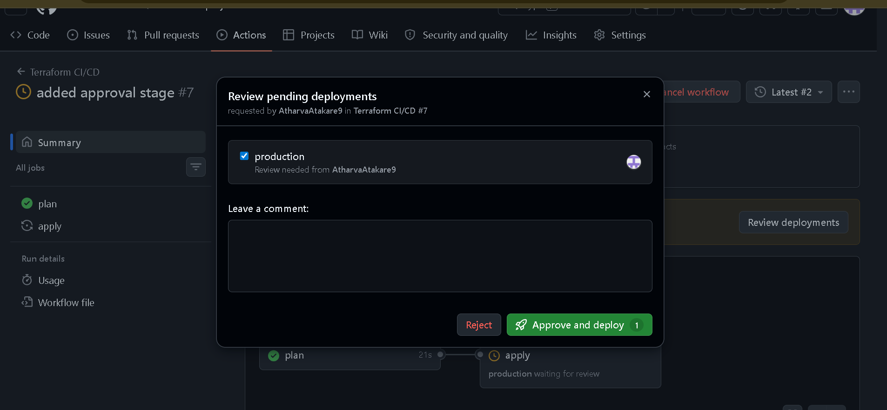
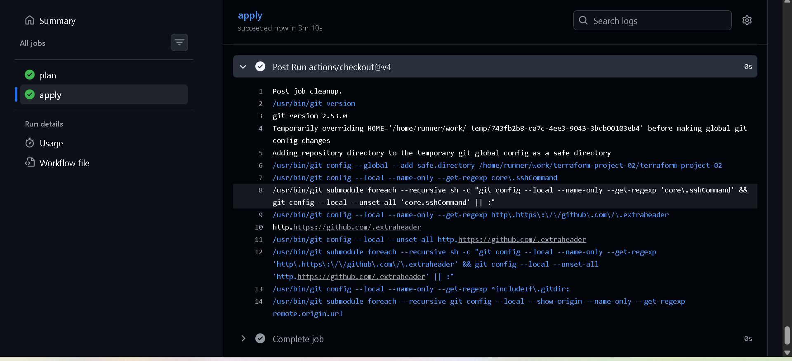
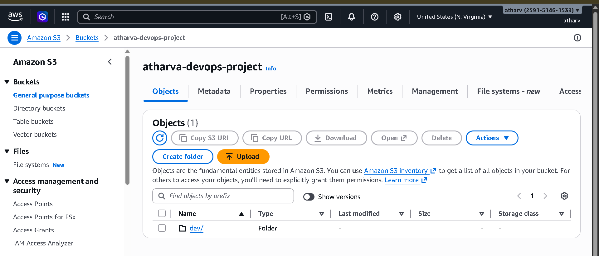
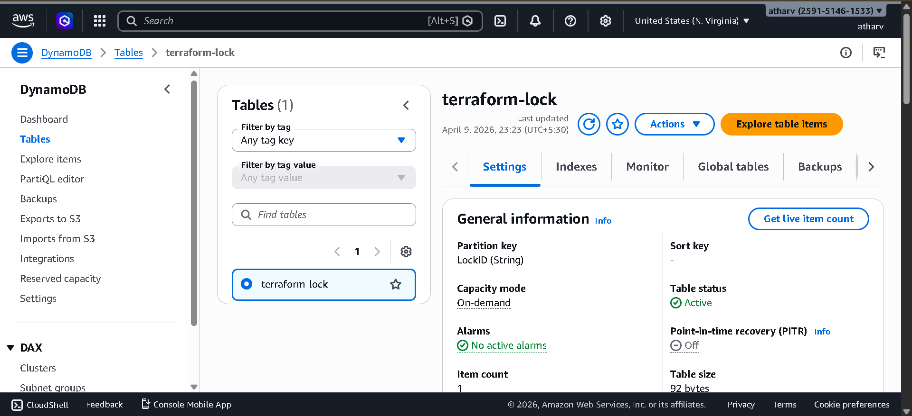

🚀 Production-Grade AWS Infrastructure using Terraform & CI/CD

---

📌 Overview

This project demonstrates a real-world DevOps implementation using Terraform (Infrastructure as Code) and GitHub Actions (CI/CD) to provision and manage a highly available, scalable, and secure AWS infrastructure.

The architecture follows industry best practices, ensuring:

- High availability using Application Load Balancer + Auto Scaling Group
- Secure networking using VPC and Security Groups
- Reliable state management using S3 and DynamoDB
- Safe deployments using CI/CD with manual approval workflow

---

🎯 Objectives

- Automate infrastructure provisioning using Terraform
- Implement CI/CD for infrastructure lifecycle management
- Ensure controlled deployments using approval workflows
- Achieve scalability and fault tolerance
- Follow modular and reusable Terraform design patterns

---

🏗️ Architecture Diagram

---

🔍 Detailed Architecture Explanation

1. Client Layer

- Users access the application through a web browser
- Sends HTTP request to the system

2. Load Balancer Layer (ALB)

- Acts as the entry point for all incoming traffic
- Distributes requests across multiple EC2 instances
- Performs health checks to ensure availability

3. Target Group

- Maintains registered EC2 instances
- Routes traffic only to healthy instances
- Improves fault tolerance

4. Compute Layer (EC2 + ASG)

- EC2 instances launched via Launch Template
- Auto Scaling Group ensures:
  - Minimum instances always running
  - Automatic scaling based on demand
- "user_data" installs and configures Nginx automatically

5. Networking Layer

- Custom VPC with public and private subnets
- Internet Gateway enables external access
- Route Tables control traffic flow

6. Security Layer

- Security Groups act as firewalls:
  - ALB → allows HTTP (80) from internet
  - EC2 → allows traffic only from ALB
- Prevents direct public access to instances

---

📸 Screenshots

AWS Infrastructure Overview

![AWS Infrastructure]Screenshots/(aws-infra.png)

Load Balancer Output

Target Group Health

Terraform Plan (CI/CD)

Approval Stage

Terraform Apply

S3 Backend

DynamoDB Lock Table

---

📁 Project Structure

terraform-project/
│
├── modules/
│   ├── network/        # VPC, subnets, IGW, route tables
│   ├── alb/            # ALB, listeners, target groups
│   └── compute/        # EC2, launch template, ASG
│
├── envs/
│   └── dev/
│       ├── main.tf     # Root module
│       ├── variables.tf
│       └── outputs.tf
│
├── .github/
│   └── workflows/
│       └── deploy.yml  # CI/CD pipeline
│
├── screenshots/
│
└── README.md

---

⚙️ Technologies Used

Infrastructure as Code

- Terraform

Cloud Platform

- AWS Services:
  - EC2
  - Application Load Balancer (ALB)
  - Auto Scaling Group (ASG)
  - VPC, Subnets, Route Tables
  - S3 (State Storage)
  - DynamoDB (State Locking)

CI/CD

- GitHub Actions

Configuration

- Linux
- Nginx (via "user_data")

---

🔐 Remote Backend Configuration

Terraform backend is configured to store state remotely:

terraform {
  backend "s3" {
    bucket         = "atharva-terraform-state"
    key            = "dev/terraform.tfstate"
    region         = "ap-south-1"
    dynamodb_table = "terraform-lock"
  }
}

Benefits

- Centralized state management
- Enables team collaboration
- State versioning for rollback
- Prevents concurrent execution using locking

---

🔄 CI/CD Pipeline (GitHub Actions)

📌 Workflow File

".github/workflows/deploy.yml"

🔁 Pipeline Stages

1. Code Push
2. Terraform Init
3. Terraform Plan
4. Manual Approval
5. Terraform Apply

---

🔒 Approval Workflow

- Uses GitHub environment protection rules
- Requires manual approval before deployment
- Prevents accidental infrastructure changes
- Ensures production-level safety

---

🚀 Deployment Steps

# Clone repository
git clone <your-repo-url>
cd terraform-project/envs/dev

# Initialize Terraform
terraform init

# Validate configuration
terraform validate

# Plan infrastructure
terraform plan

# Apply changes
terraform apply

---

🌐 Access Application

- Copy ALB DNS from Terraform output
- Open in browser:

http://<alb-dns>

---

🧪 CI/CD Execution Flow

1. Push code to "main" branch
2. GitHub Actions triggers automatically
3. Terraform plan executes
4. Pipeline pauses for approval
5. After approval → Terraform apply runs
6. Infrastructure gets updated

---

🧹 Destroy Infrastructure

terraform destroy

---

💡 Key Features

- Modular Terraform architecture
- Scalable infrastructure using ASG
- High availability using ALB
- Secure networking design
- Remote state management
- Automated CI/CD pipeline
- Manual approval for production safety

---

⚠️ Challenges & Solutions

❌ 504 Gateway Timeout

Cause:

- Incorrect security group rules
- Health check misconfiguration

Solution:

- Allowed correct ports (80)
- Fixed health check configuration

---

❌ Unhealthy Target Group

Cause:

- ALB unable to reach EC2 instances

Solution:

- Allowed ALB → EC2 traffic
- Fixed port mismatch

---

❌ Connection Timeout / No Public Access

Cause:

- Instances in private subnet without routing

Solution:

- Configured Internet Gateway
- Updated route tables

---

❌ Terraform State Conflicts

Cause:

- Multiple executions at same time

Solution:

- Implemented DynamoDB locking

---

